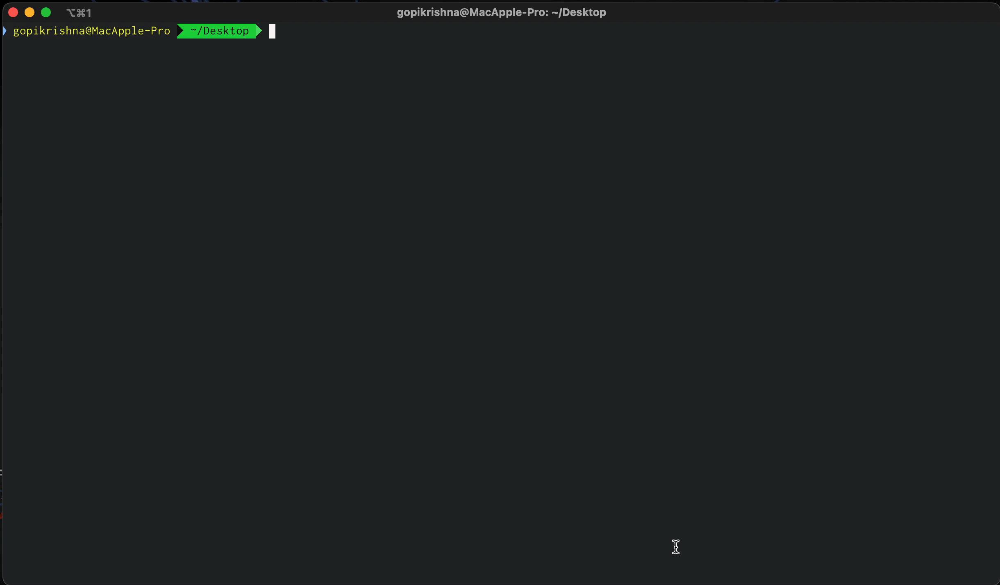

# Get AWS Cost Bills for any month and year  

## Description
  
A simple python script for viewing AWS monthly bills via CLI

Assuming you're not using a consolidated account (just one account without any organizations)

## Pre-requisites 
  
python3 must be installed [(Install python3)](https://realpython.com/installing-python/)  
awscli installed & configured! [(AWS Docs to install & configure awscli)](https://docs.aws.amazon.com/cli/latest/userguide/install-cliv2.html)  
The configured keys must have Billing permission enabled  
  
## Usage  

```  
$ git clone https://github.com/z0x0z/AWS-cost-report.git aws-cost-report  
  
$ cd aws-cost-report  
  
$ python3 cost-report.py

```

